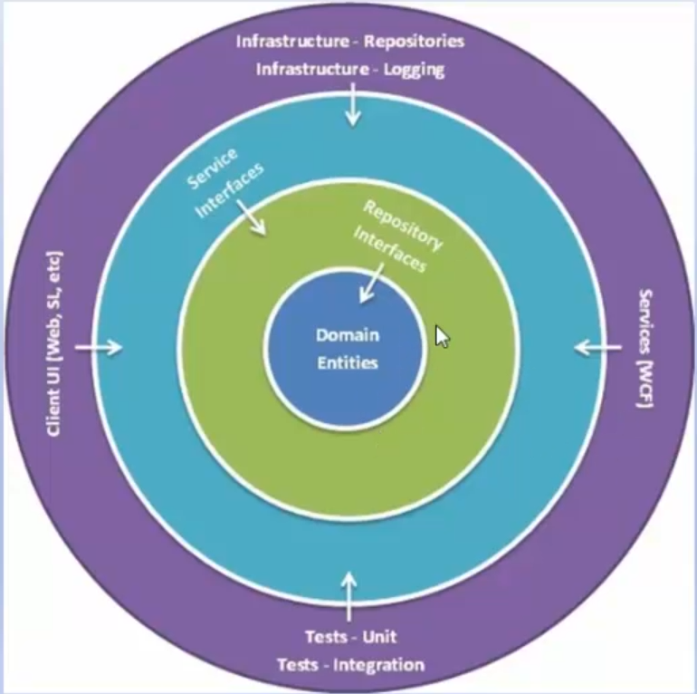
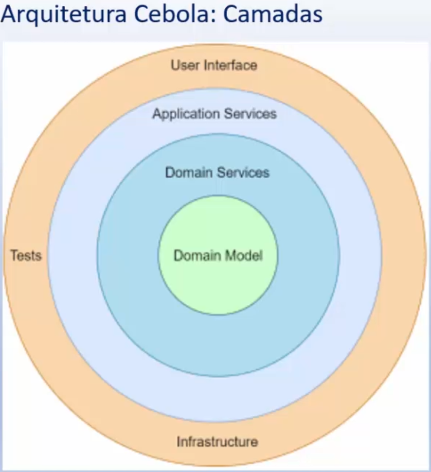
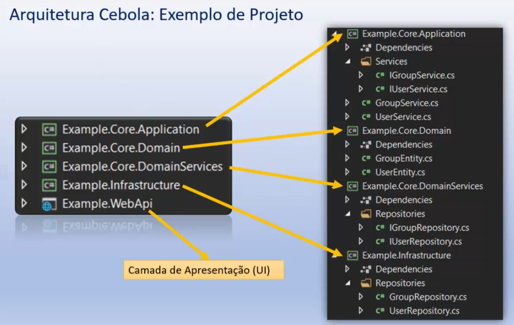

# Arquitetura Cebola
- Princípio da inversão de controle
- Não depende da camada de dados, mas nos modelos de domínios reais
- Ressolveu o problema do acoplamento entre as camadas, definindo camadas a partir do núcle para a infra

- princípio da inversão de dependência

- Camada de domínio: objetos de negócios e comportamento, pode conter interfaces de domínio. Não deve possuir nenhuma dependência.
- Camada de serviço do domínio: abstração entre entidades do domínio e lógica de negócios do aplicativo.
- Camada de serviços da aplicação: mantém interfaces com operações comuns, como adicionar, salvar, editar e excluir. Também é usada para se comunicar com a camada da interface do usuário e a camada do repositório. 
- Camada externa (UI, infraestreutra, testes): componentes mudam com frequencia: camada de apresentação, acesso aos dados e os testes.

- dificil de entender para iniciantes
- dificil de fazer divisão das responsabilidades entre as camadas