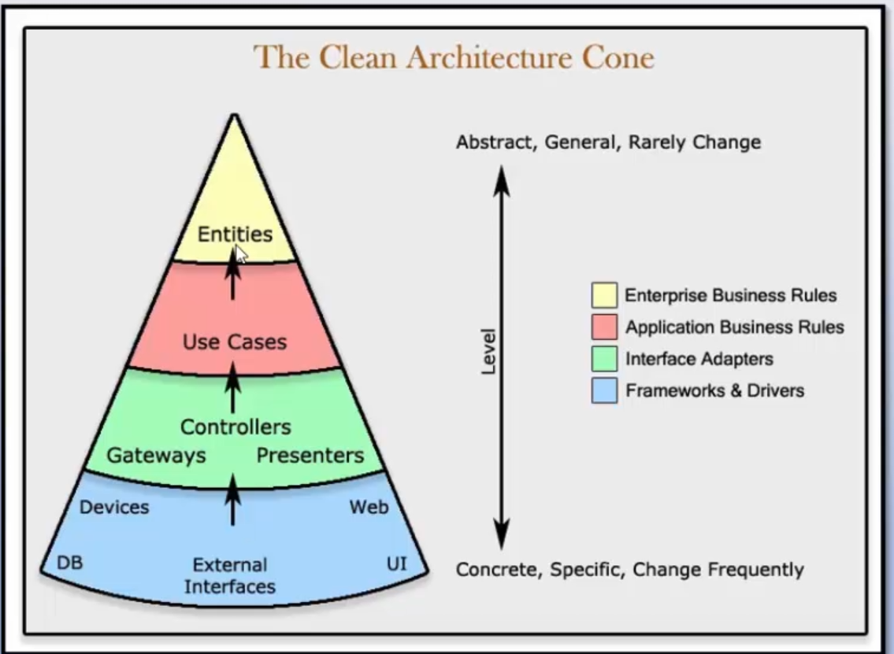

# Clean Architecture
<b>Arquitetura</b>
Arquitetura é o design geral do projeto. 
Organização do código em classes, arquivos, componentes ou módulos.
E é como todos esses grupos de código se relacionam. 
A arquitetura de software expões a estrutura em sistema enquanto oculta os detalhes de implementação.

<b>Clean Architecture</b>
- foi baseado nas boas práticas e arquiteturas hexagonal e cebola. 
- Independente de framework
- Testavel
- Independente da interface do usuário
- Independente do banco de dados
- Independente de qualquer agente externo

Regra de dependÊncia: a dependencia do codigo-fonte só pode apontar para o interior do aplicativo.

Entidades: 
- conjunto de regras de negócios relacionadas que são críticas para o funcionamento do aplicativo. 
- regras agrupadas como métodos de uma classe
- regras existem mesmo se não existir aplicação
- como entidades não conhecem as outras camadas elas não dependem de nada
Casos de uso:
- contém regras de negócio específicas do aplicativo. 
- dizem como automatizar o sistema determinando o seu comportamento. 
- Interagem e dependem das entidades, mas não sabem nada sobre as camadas mais distantes
Adaptadores: 
- Função é converter dados de um formato para outro
- Tradutores entre domínio e infraestrutura
- Implementação dos endpoints de API
- Nenhum código aqui pode saber nada sobre banco de dados
Camada externa:
- todos componentes de entrada e saída
- detalhes de implementação (BD, IU, estruturas, dispositivos)
- Facil de alterar componentes

Camadas internas são mais estáveis. 