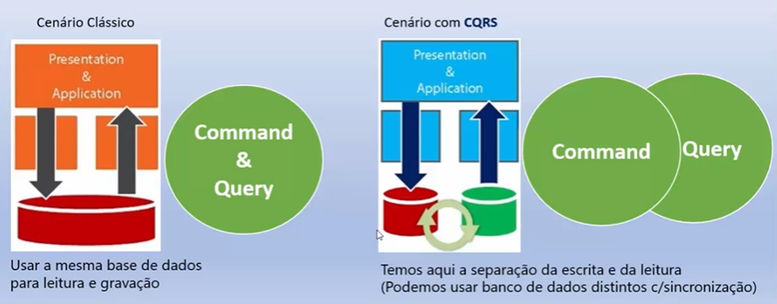

# CQRS - Command Query Responsability Segregation
Utilizado para aplicar modelos diferentes para operações de leitura e gravação.

Padrão de projeto para seprar os processos de leitura e gravação. 

- command: insert, update, delete
- queries: select

*indicado para cenários onde existe uma alta demanda de consumo de dados com operações de leitura e escrita de forma bem intensa.*

Benefícios:
- Escalas independentes.
- Segurança.
- Separação das responsabilidades.
- Consultas mais simples.

Implementações
- MediatR (padrão mediator)