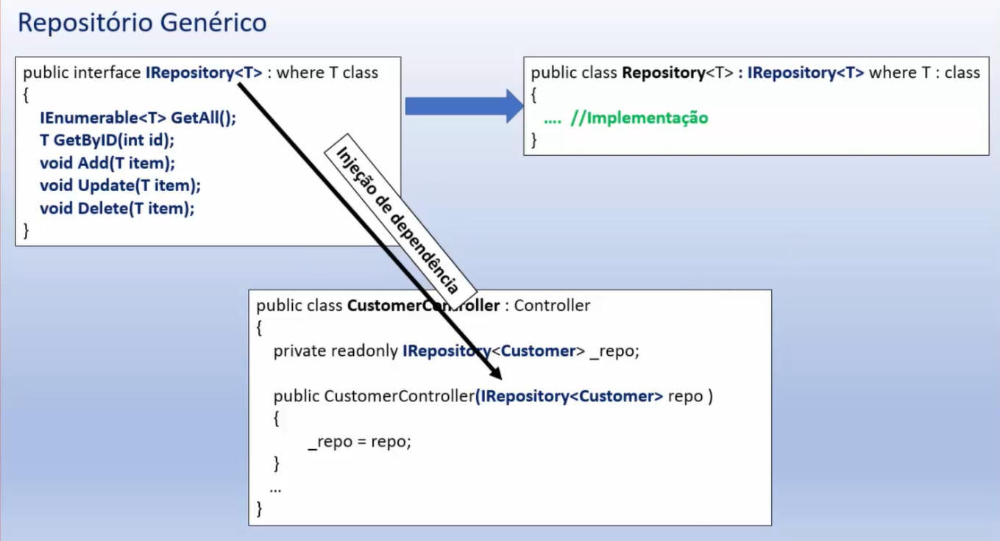

# Padrão IRepository
"faz a mediação entre o domínio e as camadas de mapeamento de dados, agindo como uma coleção de objetos de dominio em memória..."

Tipos de repositório:
- Genérico
- Específico
 

Para desacoplar o código:

Benefícios:
- Minimiza lógica de consultas na aplicação.
- Desacopla aplicação dos frameworks de persistência como o EF Core.
- Facilita testes de unidade. 
- Centraliza lógica