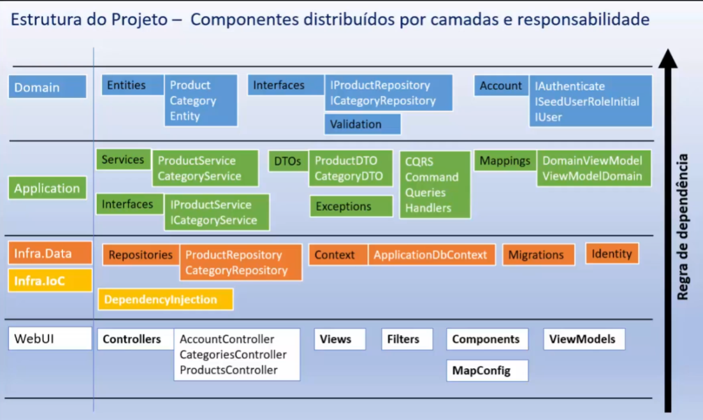

# Clean Architecture Essential 
Repositório com exemplos do curso CleanArchitectureEssential de Macoratti   

Padrões Projeto 

CleanArchMvc  
-> CleanArchMvc.Domain: Modelo de domínio, regrass de negócio e interfaces 

-> CleanArchMvc.Application: Regras de domínio da aplicação, mapeamentos, serviços, DTOs, CQRS 

-> CleanArchMvc.Infra.Data: EF Core, contexto, configurações, migrations, repository 

-> CleanArchMvc.Infra.IoC: Dependency Injection, registro dos serviços, tempo de vida 

-> CleanArchMvc.WebUI: MVC, Controllers, Views, Filtros, ViewModels 

Dependencias  
-> CleanArchMvc.Domain: Não tem dependencia 

-> CleanArchMvc.Application: Dependencia: Domain 

-> CleanArchMvc.Infra.Data:  Dependencia: Domain 

-> CleanArchMvc.Infra.IoC:  Dependencia: Domain, Aplication, Infra.data 

-> CleanArchMvc.WebUI: Dependencia: Infra.IoC 

